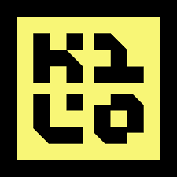
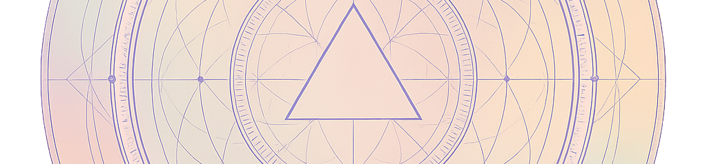

# alexzedim

> *"AI doesn't write code for me, but I use AI to write an efficient, observable code."*

### ⚡ Arsenal

#### 🤖 Artificial Intellegence

<table align="center">
<tr align="center">
    <td valign="bottom"> Kilo Code</td>
    <td valign="bottom"> Z.ai</td>
    <td valign="bottom"> GLM</td>
    <td valign="bottom"> MiniMax</td>
    <td valign="bottom"> OpenRouter</td>
    <td valign="bottom"> Cerebras</td>
    <td valign="bottom"> Ollama</td>
    <td valign="bottom"> Langflow</td>
</tr>
<tr align="center">
    <td valign="bottom"> LightRAG</td>
    <td valign="bottom"> Hermes Agent</td>
    <td valign="bottom"> n8n</td>
</tr>
</table>

#### ⚙️ Runtime Stack

<table align="center">
<tr align="center">
<td valign="bottom"> TypeScript</td>
    <td valign="bottom"> JavaScript</td>
    <td valign="bottom"> Node.js</td>
    <td valign="bottom"> Bun</td>
    <td valign="bottom"> NestJS</td>
    <td valign="bottom"> React</td>
    <td valign="bottom"> Next.js</td>
</tr>
</table>

#### 🗄️ Data & Storage

<table align="center">
<tr align="center">
    <td valign="bottom"> PostgreSQL</td>
    <td valign="bottom"> MySQL</td>
    <td valign="bottom"> MongoDB</td>
    <td valign="bottom"> Redis</td>
    <td valign="bottom"> ClickHouse</td>
    <td valign="bottom"> Neo4j</td>
    <td valign="bottom"> Qdrant</td>
</tr>
</table>

#### 📊 Infrastructure & Monitoring

<table align="center">
<tr align="center">
<td valign="bottom"> MinIO</td>
    <td valign="bottom"> Elasticsearch</td>
    <td valign="bottom"> Grafana</td>
    <td valign="bottom"> Prometheus</td>
    <td valign="bottom"> Loki</td>
    <td valign="bottom"> RabbitMQ</td>
</tr>
</table>

#### ☁️ Cloud & DevOps

<table align="center">
<tr align="center">
    <td valign="bottom"> AWS</td>
    <td valign="bottom"> Google Cloud</td>
    <td valign="bottom"> DigitalOcean</td>
    <td valign="bottom"> Hetzner</td>
    <td valign="bottom"> Docker</td>
    <td valign="bottom"> GitHub Actions</td>
    <td valign="bottom"> Portainer</td>
</tr>
</table>

#### 🛠️ Tools & IDEs

<table align="center">
<tr align="center">
    <td valign="bottom"> VS Code</td>
    <td valign="bottom"> WebStorm</td>
    <td valign="bottom"> DataGrip</td>
    <td valign="bottom"> Zed Code</td>
    <td valign="bottom"> Git</td>
    <td valign="bottom"> Ubuntu</td>
    <td valign="bottom"> Windows Terminal</td>
</tr>
</table>

#### 🤝 Collaboration & Quality

<table align="center">
<tr align="center">
    <td valign="bottom"> Jira</td>
    <td valign="bottom"> Trello</td>
    <td valign="bottom"> Redmine</td>
    <td valign="bottom"> Jest</td>
    <td valign="bottom"> StackOverflow</td>
</tr>
</table>

---

### 📊 GitHub Stats

---

### 🚀 Featured Projects

<table>
  <tr>
    <td width="50%">
      
    </td>
    <td width="50%">
      
    </td>
  </tr>
  <tr>
    <td align="center">
      <a href="https://github.com/alexzedim/cmnw"><strong>C M N W</strong></a>
       
      <i>Intellegence always wins</i>
    </td>
    <td align="center">
      <a href="https://github.com/alexzedim/cmnw-oraculum"><strong>O R A C U L U M</strong></a>
       
      <i>Open your eyes</i>
    </td>
  </tr>
</table>

---